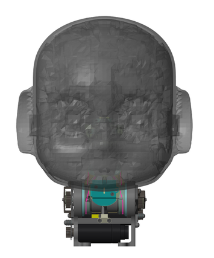

Study iCub Head – Simulations
=============================

<center>
</img>
</center>

This branch contains the material used to model the iCub head in MATLAB Simscape, and design the pitch and roll PID controllers.
It is split into two projects:
- `model-full` contains the full Simscape Multibody model exported directly from Creo.
     - it is used to evaluate the actuators performance and the impact of non linear behaviour on the reference tracking.
- `model-simplified` contains a Simscape Multibody model with just the roll and pitch joints, created as lumped components.
    - it is used for creating the linearized models upon which the PIDs will be tuned.

## Requirements
 - MATLAB >= R2022b
 - Simulink
 - Control System Toolbox
 - Robust Control Toolbox
 - Simscape
 - Simscape Driveline
 - Simscape Electrical
 - Simscape Multibody
 - (optional) Parallel Computing Toolbox

## Usage

## Helper script
The repository provides the Matlab Live script `launch.mlx` to run the two projects sequentially, with integrated documentation.
Alternatively, the projects can be launched separately.

### Running `model-full`
- Double click on the MATLAB project file `neck-study-full.prj`. Upon opening, the Simulink model `neck_head_control.slx` will be brought up and the controllers will be imported.
- To run the simulation simply click on `Run`.
- 👉🏻 By default, the project loads the autotuned PID parameters located in the file `data/pitch_roll_controllers.mat`. Legacy PID parameters are instead located in the script `scripts/initialization_data.m`.
### Running `model-simplified`
- Double click on the MATLAB project file `neck-study-simplified.prj`. This project contains scripts for running the robust tuning procedure using uncertain models.
- To create the uncertain roll and pitch transfer functions, run the script `create_uncertain_models.m`.
- To run the robust tuning, launch the script `launch_autotune.m`. This script assumes that the transfer functions are available in the workspace. If you do not want to run the creation script, you can load the workspace file `model_transfer_functions.mat`.
- For a later use with the full Simscape model, you can save the controllers with the command
  ```matlab
  save('your-desired-filename.mat', 'Cz_pitch', 'Cz_roll')
  ```
  
