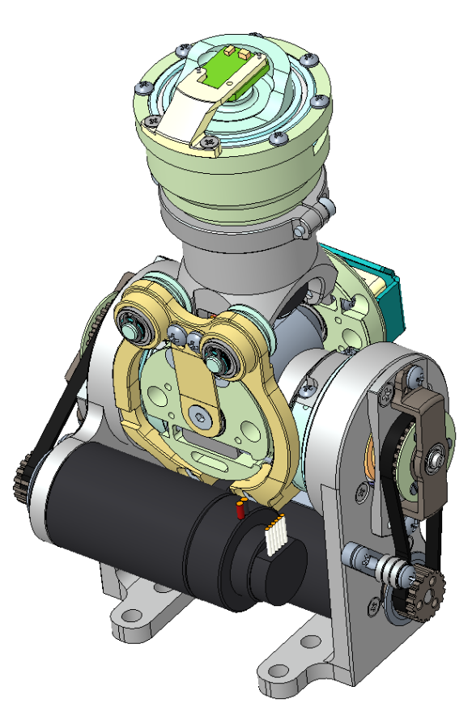
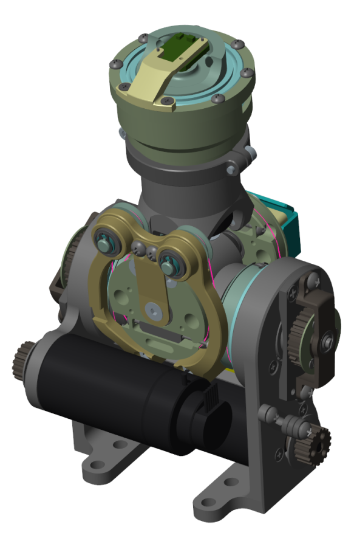
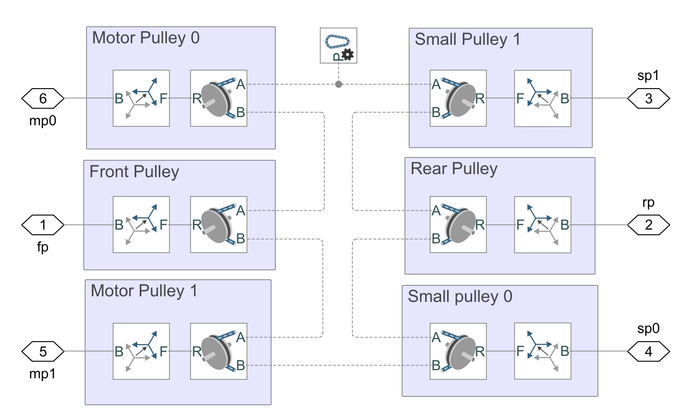
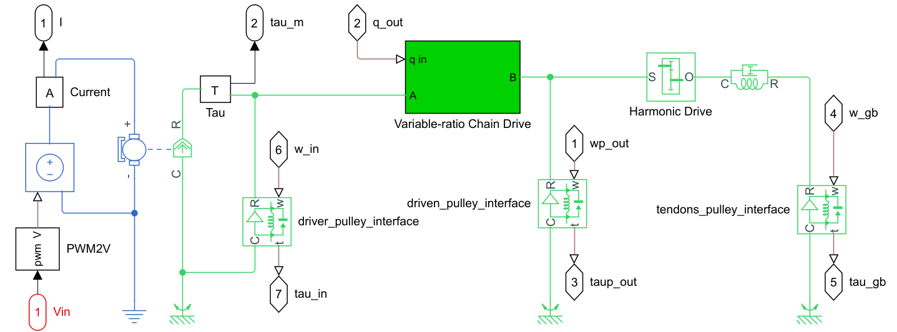
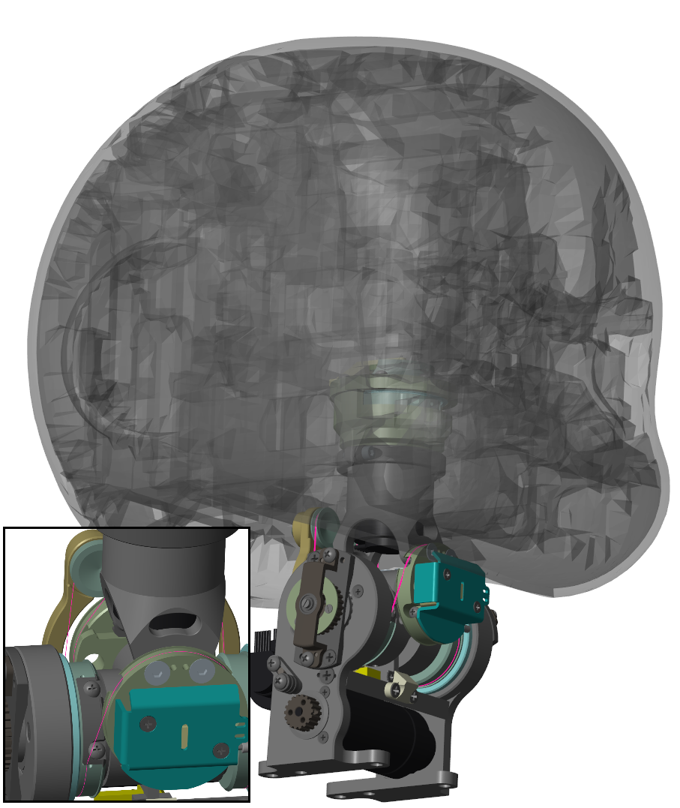
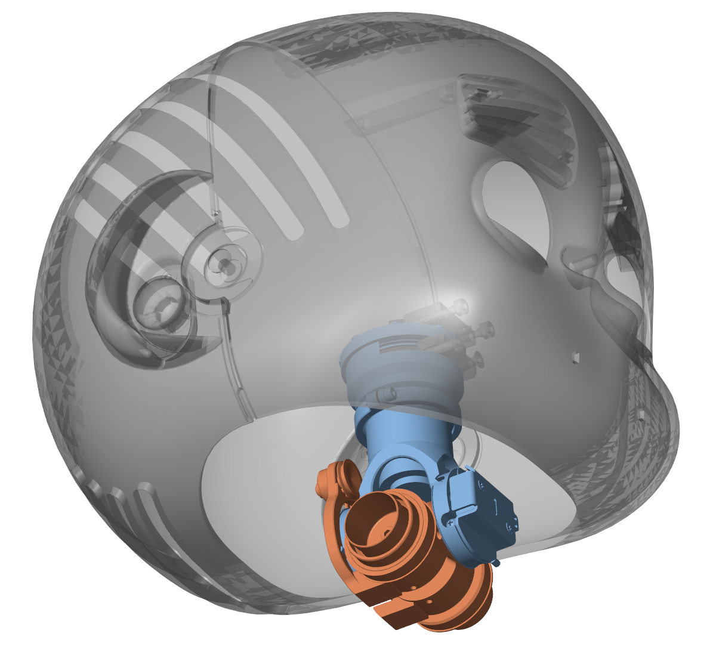

Workflow
====

# a. Creation of the digital twin
In order to build the digital twin of the iCub head, we took advantage of *Simscape Multibody Link* to export the assembly from PTC Creo. The CAD model allows for accurate placement and computation of the dynamic parameters involved in the simulation. In return, the Simscape representation can provide insight on the kinematics and dynamics.

First, the neck assembly was exported. The neck allows the iCub head to move along pitch, roll, and yaw degrees of freedom. While they are designed as a serial chain, the pitch and roll joints move thanks to a coupled transmission: two DC motors transmit torque to a cable differential through two timing belts and Harmonic drives. If the two motors velocities have the same sign, the roll angle rotates. Conversely, opposing signs move only the pitch angle. 

On the other hand, the yaw joint moves independently and therefore it is not discussed.
|Fig.1a cad model| Fig.1b simscape model|
|-|-|
|  | |

Significant effort was spent modelling the cable differential with Simscape multibody, and the timing belt transmission with Simscape Driveline. Thanks to Simscape's capabilities, we were able to design the differential coupling by running the virtual cables through all the involved pulleys, in order to accurately mimick the physical mechanism. Additionally, the outer transmission model allowed us to easily add nonlinear behaviours, such as belt slack, and pulley flattening.

|Fig.2a Cable differential| Fig.2b Outer transmission|
|-|-|
|  |  |

The rest of the head was later added as a lumped solid, to simplify the model compilation.

# b. Uncertain linearized model
The next step involves the linearization of the Simscape model. Due to the high number of states created by the *Model Linearizer*, we created through the CAD software a simplified assembly made by just three lumped parts: the roll joint, the pitch joint, and the head. Additionally, we created a simplified linear outer transmission model, in order to make the complete linearized system easily tractable.

Taking advantage of the *Robust Control Toolbox*, we created a set of decoupled uncertain transfer functions for both the pitch and roll joints, accounting for different operating points.

|Fig.3a full head | Fig.3b simple head|
|-|-|
| | |

# c. Autotuning
Finally, we defined both the soft and hard goals for the autotuning procedure, to find robust gains for both the pitch and roll discrete PID controllers.