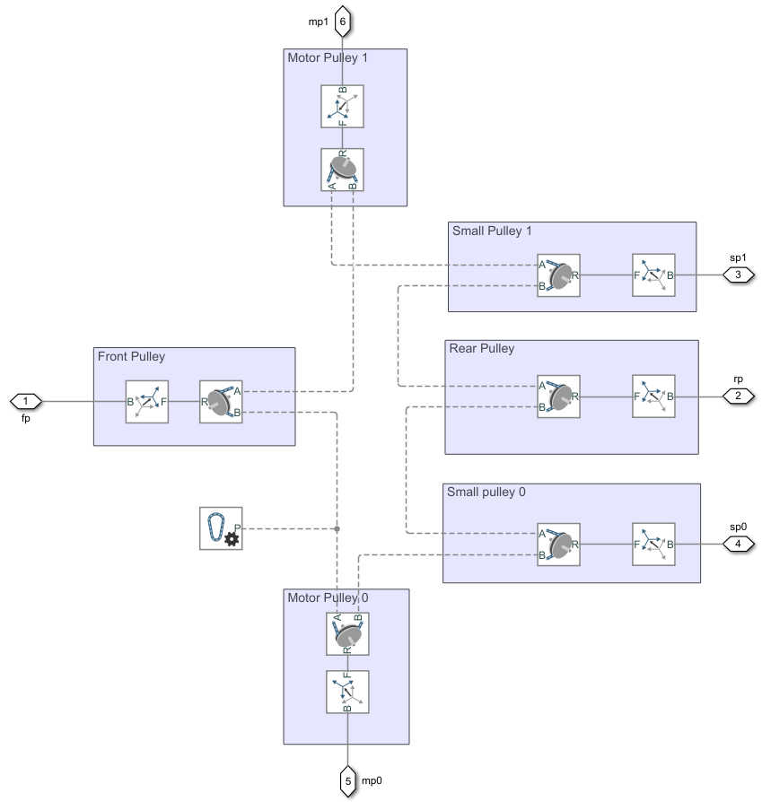

# Modelling the neck mechanism in Simscape
Creating a model of the neck is a fundamental step to study the real mechanism, both for the actuation requirements and robustness performance. With the Simscape Multibody library for Simulink it is possible to import the relevant CAD model and add the necessary couplings (cables, gearboxes...).

## Definition of moving parts and degrees of freedom
The figure below highlights in red the degrees of freedom involved in the study, namely roll and pitch. The neck yaw is ignored, since its actuation sits independently on top of the other two. The components highlighted in green rotate to allow the neck motion along the desired DoFs. They consist in pulleys linked together by belts, gearboxes, and tendons (aka cables).

.
The tendons circuit allows pure pitch when the motor rotate towards the same direction (torques with opposite signs), and pure roll when they rotate in opposite direction (torques with the same sign).
## The neck in Simulink
The import process of the neck model in Simulink/Simscape results in the following diagram:

The model, however, requires adjustments in order to be simulated as expected.
### Manual adjustments to the model
The imported model follows closely the components' heirarchy of the CAD structure. However, the CAD parts heirarchy prioritizes the mounting procedure instead of dynamics accuracy. The following modifications were done on the model imported straight from the XML file generated by Creo.
#### Relocation of the pitch joint
Due to mounting requirements, the revolute joint that allows the neck pitch sits before the joints associated to the motor pulleys. The picture below shows the relevant Simscape subsystem.

In this configuration, if the motor pulleys rotate in the same direction and try to pull down the front pulley attached to pitch joint, they cannot succeed. It is possible to fix this issue by moving the motor joints and attach them to the Base port of the pitch joint, like in the picture below.

This modification requires the addition of two rigid transformation blocks (highlighted in orange) to properly realign the components that were moved.
The blocks implement a translation along the Z axis of 5.5767mm and a rotation along Y of -90deg. The translational value is the opposite of the one set in the *Transform5* block.

#### Pin Removal
A mechanical pin is placed on the pitch shaft, and needs to be removed to allow proper motion. This is caused by the way the CAD assembly is mounted. After isolating the relevant components, they can be commented out, as shown below.

#### Addition of the transmission joints
The timing belts which transmit the torque from the motors to the gearboxes use toothed pulleys which require revolute joints to rotate. They can be added by identifying the assemblies that must rotate and placing them with the appropriate transforms. The necessary rotation that the transform must apply to make the pulley rotate along its principal axis can be found out by inspection of the 3D model in Simscape. This operation is necessary because the revolute joint block has its rotation primitive only along Z and it cannot be changed.

 The belts are be commented out and ignored, as they could impair the simulation. 
## Modelling the torque transmission from the torque to the joints
### The outer transmission
The outer transmission system that transfers torque to the joints and reduces the output velocity is not modelled with the Multibody libraries, but with the 1D Simscape Mechanics blocks. More specifically, the system is made by a timing belt system, connecting the DC motor output to the gearbox input (specifically, a harmonic drive). The gearbox then drives the internal motor pulley connected to the tendons system. 

#### Motors specifications

The chosen DC motor is the **Faulhaber 2432 012 CR**, which parameters are shown in the table below

| | Value | UoM |
|---|---|---|
| **Nominal Voltage** | 12 | V|
| **Nominal Torque** | 16mm | mNm|
| **No Load Current** | 0.075 | A |
| **No Load Speed** | 8000 | rpm |
| **Armature Resistance** | 1,9 | Ohm |
| **Rotor inductance** | 65 | uH |
| **Torque constant** | 13.4 | mNm/A |
| **Rotor Inertia** | 5.6 | gcm2 |

#### Spring-Damper Filters
The spring-damper filters are added to the 1D model to allow correct run of the simulation. Without them, the Simscape solver would not be able to solve the internal equations. However, the filters should not significantly alter the dynamics, as they should not exist on the robot. Because of this they are designed with a 34Hz cutoff frequency, which is higher than the bandwidth defined by the mechanical time constants of the system.

**First stage filter**

The first filtering stage is placed between the driven pulley interface and the gearbox
The transfer function between the input and ouput shaft angle is:

$$
 \frac{\theta_o(s)}{\theta_i(s)} = \frac{b s + k}{(J_1 + \frac{J_2}{\eta^2})s^2 +b s + k}
$$

where 

- J1 = driven pulley inertia = $ 0.0913 Kg\cdot mm^2 = 9.13 \times 10^{-8} Kg\cdot m^2 $
-  J2 = head inertia = $$ \frac{2}{5} m \cdot R^2 + m \cdot d^2 = 0.022 Kg \cdot m^2 $$

   where
   - *R* is the head radius when modelled like a homogenous sphere, which center is the yaw joint origin = 120mm
   - *d* is the distance between the pitch joint origin and the yaw joint origin = 78.65mm
   - *m* is the head mass = 1.86Kg   

-  $ \eta $ = gearbox ratio = 100
-  *b* is the viscous friction, which damps the system
-  *k* is the stiffness of the spring

The head inertia is computed as

By choosing 
*b* = 20 Nm/(rad/s) / $\eta^2$
*k* = 200 Nm/(rad) / $\eta^2$

we get the following Bode diagram highlighted in orange. Without the downscaling effect of the squared reduction ratio, the bandwidth (in blue) would have been unnecessarily large and would have amplified small unrealistic oscillations.

The numerical transfer function is:
$$
\frac{\theta_o(s)}{\theta_i(s)} = \frac{864.34 (s+10)}{(s+854.2) (s+10.12)}
$$
**Second stage filter**
The second stage filter does not involve the reduction ratio, therefore the choice of *b* and *k* stems from the simple transfer function:

$$
\frac{\theta_o(s)}{\theta_i(s)} = \frac{ b s + k}{J s^2 +b s + k}
$$

where J is the head inertia, with the same value as the first stage.
By choosing 
*b* = 20 Nm/(rad/s) 
*k* = 200 Nm/(rad)
we get the following Bode diagram, which matches the detuned first stage:

The numerical transfer function is:

$$
\frac{\theta_o(s)}{\theta_i(s)} = \frac{899.85 (s+10)}{(s+899.7) (s+10.11)}
$$

#### Timing belt modeling
The timing belt reduction ratio is
$$
r_B = \frac{R_2}{R_1} = 1.167
$$
with the following parameters
|*Timing belt*|Pitch Radius [mm]|
|---|---|
|Driving pulley $R_1$|5.82|
|Driven pulley $R_2$|6.79|

The timing belts transmitting power from the neck motors to the harmonic drives are modelled in Simscape with a *Chain Drive* block. The block allows the setup of a slackness parameter and chain dynamics through a translational spring-damper model. From the Matlab documentation, the chain tensile force is expressed as:

$$
F=
\begin{cases}
   -(x - \frac{S}{2})k - \dot{x}b, \quad x > \frac{S}{2} \\
    - \dot{x}b, \qquad  \qquad \qquad\frac{S}{2} \geq x \geq -\frac{S}{2} \\
   -(x + \frac{S}{2})k - \dot{x}b, \quad x < -\frac{S}{2}
\end{cases}
$$

The equations of motion of the chain drive with the above tensile model can be found with the Lagrangian approach:
$$
\frac{d}{dt} \frac{\partial L}{\partial \dot{q}} - \frac{\partial L}{\partial q} = Q , \quad \text{with } L = T -U
$$

where
- $q$ is the vector of independent variables 
- $T$ is the kinetic energy
- $U$ is the potential energy
- $Q$ is the vector of generalized forces.

In this scenario the independent variables $q$ are the angles of the driving and driven pulley, $\theta_1$ and $\theta_2$ respectively. It follows that their radii are $R_1 , R_2$, and their inertias are $J_1 , J_2$.
The vector $Q$ is made only by the input torque to the driving pulley.

The discontinuos model of the tensile strength requires the simplifying assumption to use only one of the equations. We will use the first one, in which the slack $S$ acts as a positive input to the model.

The computation of $T$ assumes that the pulleys are spinning along their principal axes of inertia:
$$
T = \frac{1}{2}J_1\dot{\theta_1}^2 + \frac{1}{2}J_2\dot{\theta_2}^2
$$

The potential energy accounts for the contribution of the translational spring-damper model
$$
U = \frac{1}{2}k x^2 + \frac{1}{2}b\dot{x}^2
$$

The linear displacement $x$ can be found as a function of the angles
$$
x = \theta_2 R_2 - \theta_1 R_1
$$

Therefore
$$
U = \frac{1}{2}k (\theta_2 R_2 - \theta_1 R_1)^2 + \frac{1}{2}b (\dot{\theta_2} R_2 - \dot{\theta_1} R_1)^2
$$

The generalized forces can be found by exploiting the principle of virtual work
$$
\delta L = \tau \delta \theta_1 + \frac{Sk}{2} \delta x = \tau \delta \theta_1 + \frac{Sk}{2} \left( \frac{\partial x}{\partial \theta_1} \delta \theta_1 + \frac{\partial x}{\partial \theta_2} \delta \theta_2 \right) =  \tau \delta \theta_1 + \frac{S}{2}k R_2 \delta \theta_2 - \frac{S}{2}k R_1 \delta \theta_1
$$

Therefore

$$
Q_1 = \tau - \frac{S}{2}k R_1 \qquad Q_2 = \frac{S}{2}k R_2 
$$

Performing the lagrangian derivations and summing up everything we get the following equations of motion

$$
\begin{cases}
J_1 \ddot{\theta_1} + kR_1^2\theta_1 - k R_1 R_2 \theta_2  + bR_1^2\dot{\theta_1} - b R_1 R_2 \dot{\theta_2} = \tau - \frac{S}{2}k R_1\\
J_2 \ddot{\theta_2} + kR_2^2\theta_2 - k R_1 R_2 \theta_1  + bR_2^2\dot{\theta_2} - b R_1 R_2 \dot{\theta_1} = \frac{S}{2}k R_2 \\
\end{cases}
$$

As a simplifying assumption we can say that $R_1 = R_2 = R = 6.79mm$, finding that we can achieve the same bandwidth with the relationship
$$
k_{chain} = \frac{k_{filter}}{R^2 \eta^2} \qquad
b_{chain} = \frac{b_{filter}}{R^2 \eta^2}
$$
In the model we use $R_2$ as radius, finding the values:
$$
k_{chain} = 433,8 N/m\qquad
b_{chain} = 43.38 N/(m/s)
$$
that can be used to replace the first stage filter
#### Pulley ellipticity
Manufacturing defects on the pulley can cause a flattening effect on the pulley diameters. This effect can be considered an impairment that causes velocity oscillations in the output of the timing belt transmission. These oscillations are caused by a variation of the transmission ratio. 
Let us consider the ellipticity on the driven pulley, modelled in such a way:
 - $A$ first semiaxis
 - $B$ second semiaxis, where $B = A  \cdot flattening $ 

Additionally, the circular driving pulley radius will be noted as $r$. $c$ is the distance between the centers of the pulleys.
We can write the following relationship:
$$
\left(c \cdot \cos\theta \cdot m + c \cdot \sin\theta + \sqrt{A^2 \cdot m^2 + B^2}\right)^2 = r^2 \cdot (m^2 + 1)
$$

where $m$ is the slope of the line connecting the two points of contact between the belt and the pulleys. $\theta$ is the driving pulley angle. The equation is solved by finding $m$ numerically, for each integer value of $\theta$ in the interval [0, 360]. 

The elliptic pulley radius can be seen as a circle whose radius depends from the driving pulley angle, $R(\theta)$.
Therefore
$$
R(\theta) = \frac{\sqrt{A^2 \cdot m(\theta)^2 + B^2}}{\sqrt{m(\theta)^2 + 1}}
$$

and the timing belt transmission ratio becomes
$$
r_B = \frac{R(\theta)}{r}
$$

In Simscape the variable-ratio chain drive is modelled through a custom block:

`r_a` corresponds to $r$, and `r_b` corresponds to $R(\theta)$. The latter is evaluated with a lookup table, that takes in input the driving pulley angular position.

#### Harmonic Drive modeling
The chosen harmonic drive provides a reduction ratio of 100. While Simscape provides a harmonic drive block, it needs the number of teeth as parameters. The information is not available in the datasheet. Because of this, it will be modelled as a simple gear box block with a reduction ratio $ r_H = 100$.

The total reduction ratio comprised with the timing belt system is
$$
r = r_B \cdot r_H = 116.7 
$$

A possible impairment that could be added to the model is the backlash on the harmonic drives of the coupled motors. The HDs are famous for being backlash-free, but with time the flexpline could degrade and cause gear play. 
A rotational hard stop block is added before the gearbox to model this behaviour. The datasheet provides a *Lost Motion* parameter, which is 1/60th of a degree. A degradation factor can be multiplication term for this parameter. The block also models the contact between teeth with a spring-damper model.

The block parameters are the following:
|Parameter| Value| Unit|
| --- | --- | --- |
| Degrading factor | [10 50 100] | . |
| Contact Stiffness | 3.81e3 | Nm/(rad) |
| Contact Damping | 0.01 | Nm/(rad/s) |

### The tendons circuit
The internal tendons circuit of the neck was created to allow pitch and roll motion when the two axes do not sit on the same plane. The mechanism acts as a differential: concordant torques with the same amplitude spin the pulleys to make the neck roll; discordant torques with the same amplitude pull down the front pulley and make the neck pitch.
The real mechanism uses two cables that end inside the roll-aligned pulleys, and wrap around the motor pulleys twice. This configuration can be simplified in Simscape with only a single cable, like the figure below (cable coloured in magenta). The result, both in kinematics and dynamics, is equivalent.

The following picture illustrates the cable circuit, which mimicks the topology of the real system. The pulley blocks are complemented with rigid transforms that move the reference frames right on the pulleys' solids, for added realism. The pulleys are then connected to the follower ports of the respective revolute joints.

#### Results
The following plots highlight the capabilities of the cables differential.

## Mounting the head on the neck
The head can be seen as a solid assembly with no degrees of freedom between its internal parts.
It was mounted on the neck by following a similar procedure to the one on the real robot.