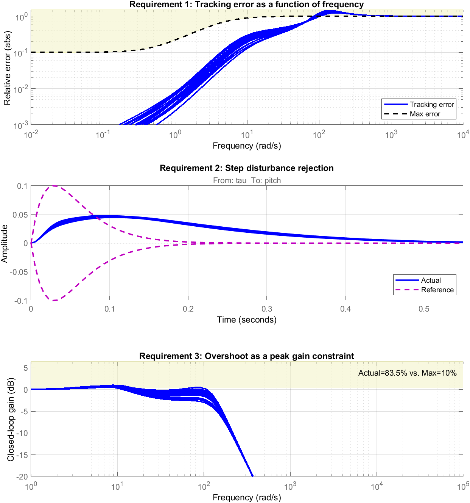
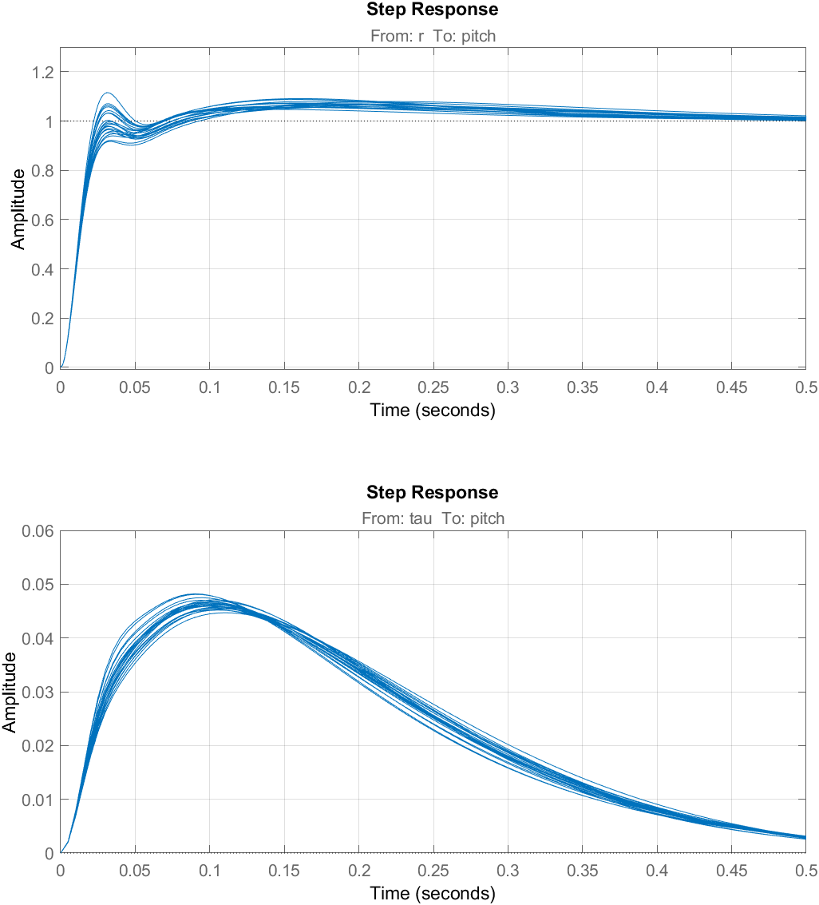
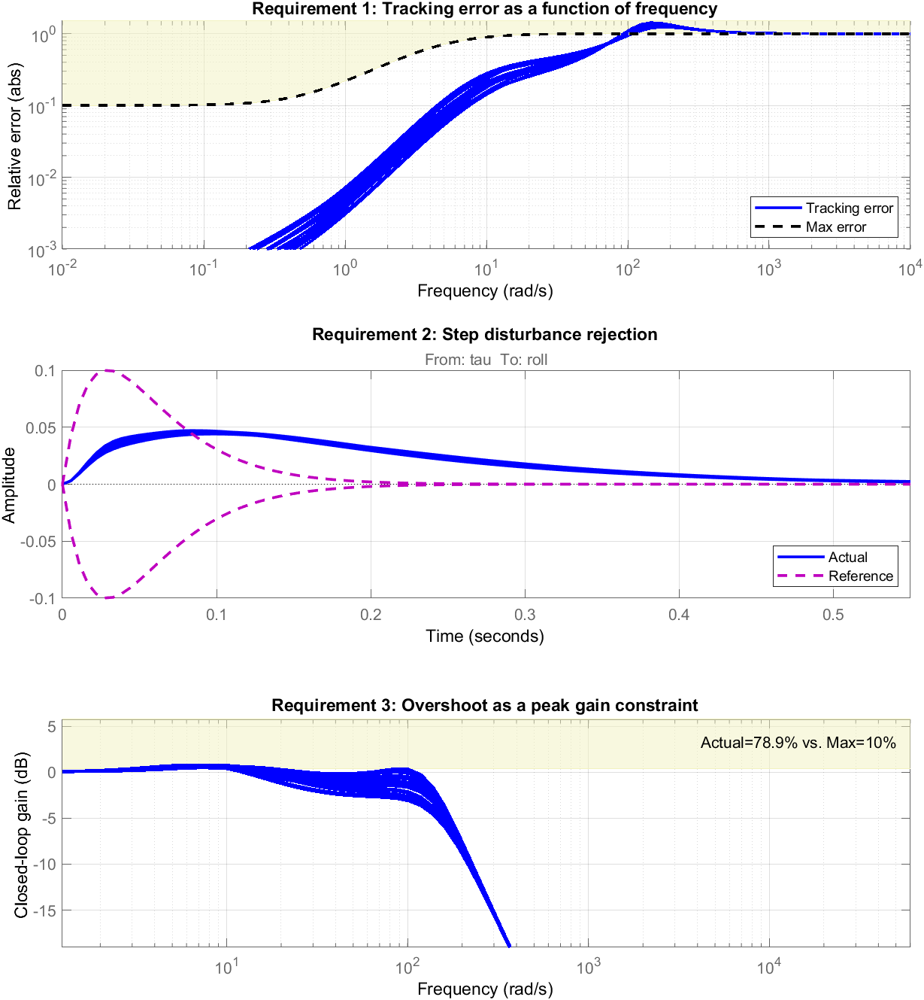
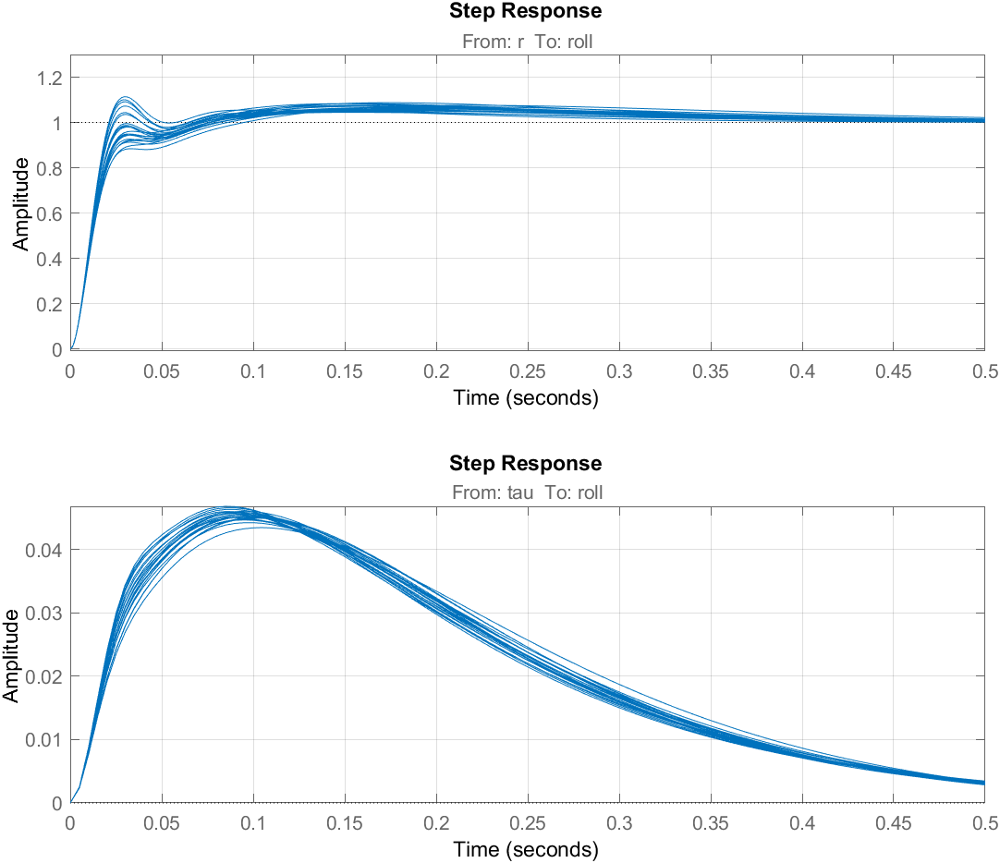
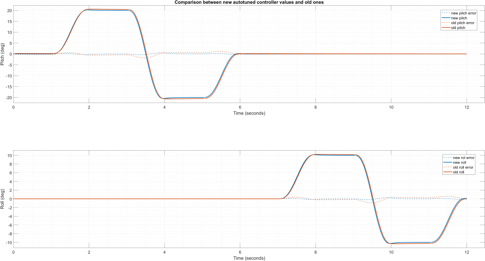
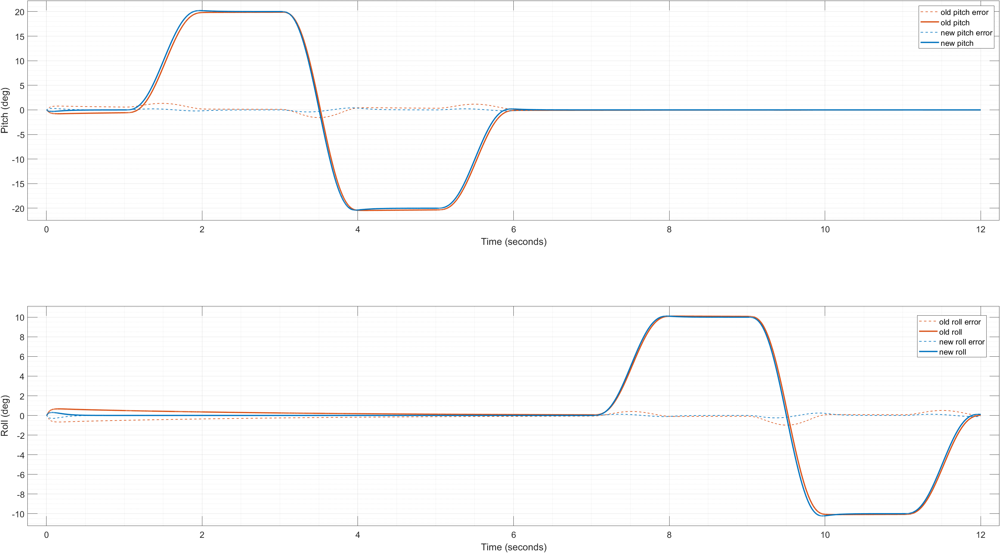
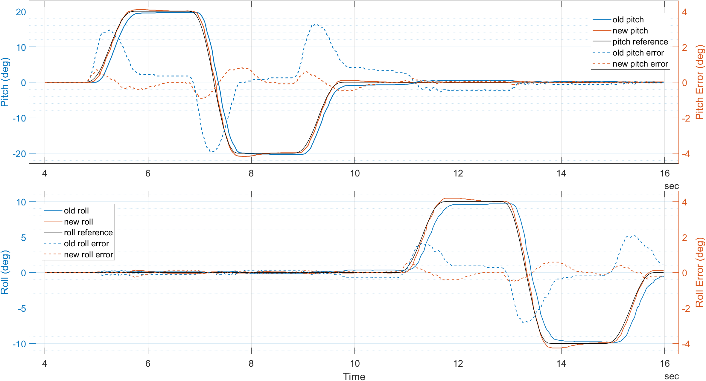

Tuning and Simulation results
=============================

The models in `model-simplified` were used to create linearized plants to independently tune pitch and roll degrees of freedom.
The autotuning process required setting hard and soft goals. The newly found gains were then tested on Simscape model contained in `model-full`.

## 1. Requirements setup
The requirements were the same for both the pitch and the roll controllers.

### Soft requirements

| **Trajectory tracking** | |
|---|---|
|Response time | 0.4 sec |
|DC error | 0.1 % |
|Peak error | 1.0 |

### Hard requirements

| **Step rejection** | |
|---|---|
|Peak absolute response| 0.1 deg |
| Settling time | 0.2 sec |
| **Overshoot** | |
| Max overshoot | 10 % |

## 2. Autotuning results

The PID values found are displayed in the table below. As expected, there are similarities between the two controllers, but no exact matching due to the different inertias in the two directions.

||**Pitch** |**Roll**|
|---|---| --- |
|**P**  (% / deg) |19.2|16.3 |
|**I**  (% / (deg · s)) |85.7 | 85.7 |
| **D** (% / (deg / s)) | 0.46 | 0.464 |
|**N** | 100 | 100 |

The following plots show the result of the autotuning process ran with MATLAB's `systune` function.

### Pitch

### Roll

**Note**
The estimated overshoot value overlayed on the Bode diagrams is not accurate, as it does not correspond with the step response overshoot in the time domain.

## 3. Simulation results

The actuators' performance and the newly computed PID parameters were evaluated by applying a minimum-jerk roll-pitch reference trajectory to the full-fledged model. 
The waypoints were chosen in a range within the existing hardware limits of the existing iCub models. 

The legacy PID parameters used to control the roll and pitch have the same values:
|P |I| D |
|---|---| --- |
|9 | 3 | 0.2 |

The legacy values are used by the firmware on the existing robots, scaled by the following ratio

$$
gain\_simulation = \frac{max\_effort\_pwm}{max\_effort\_firmware} \cdot gain\_firmware
$$

where 
*max_effort_pwm* = 100 
*max_effort_firmware* = 3360
*P gain on firmware* = 300
*I gain on firmware* = 100

The saturation values were chosen as {-100, 100}, representing the PWM duty cycle percentage.

The plots below show a comparison of the min-jerk angle trajectories between legacy (old) and autotuned (new) controllers.

Due to the low gains, a long settling time is present. On the other hand, the autotuned parameters drastically improve performance in ideal conditions.

### Results with a tilted torso
The motors on the neck can be subject to additional strain when the torso is tilted, especially with a combination of:
 - torso pitch: 90°
 - torso roll: 45°

Even in this case, we can notice the beneficial effect of more responsive controllers.

## 4. Results on the robot
The new gains on the robot yield much needed improvements regarding trajectory tracking, but also regarding rejection of the coupling effects caused by the 

## 5. Metrics
To quantitatively evaluate the benefits of the autotuning process, we can compute the rmse with the old and new PID values:

||RMSE (deg) Default gains| RMSE (deg) Tuned-up gains|
| --- | --- | --- |
| **Pitch** | |
| Simulation | 0.313 | 0.0587 |
| Robot | 0.705 | 0.162 |
| **Roll** | |
| Simulation | 0.129 | 0.0297 |
| Robot | 0.450 | 0.122 |
